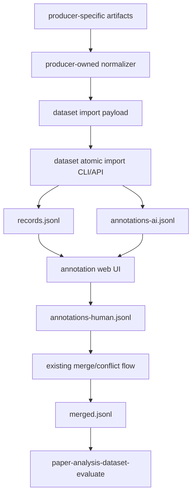

# Dataset Atomic Import Interface Plan

**Target repo:** `third_party/paper_analysis_dataset`

---

## Overview

The main Paper Analysis repository now produces daily arXiv recommendation outputs and AI cross-review results. The dataset repository should not know or parse those main-repo artifact formats. Its responsibility should be narrower and more stable: expose an atomic import interface that accepts dataset-shaped records plus optional AI prelabels, then persists them into the existing paper-filter benchmark and annotation workflow.

Main-repo orchestration remains outside this plan. The main repo can read its own report/review artifacts, combine recommendation positives and AI review findings, resolve precedence, and emit a normalized dataset import payload.

This child-repo plan intentionally reuses existing dataset assets:

- `data/benchmarks/paper-filter/records.jsonl` as the only metadata table
- `annotations-ai.jsonl` for machine prelabels
- `annotations-human.jsonl` for human review
- `conflicts.jsonl` and `merged.jsonl` for merge/arbitration
- `paper-analysis-dataset-annotation-app` for human labeling
- `paper-analysis-dataset-evaluate` for benchmark evaluation against the main repo API

No parallel review library, new annotation UI, or main-repo artifact parser should be introduced in the dataset repo.

---

## Problem Frame

The recommendation algorithm appears overfit to the existing benchmark and performs poorly on the daily arXiv distribution. Daily recommendation positives, false-positive challenges, borderline cases, and missed-positive challenges should all become high-value benchmark candidates.

The clean boundary is:

`producer-specific artifacts -> producer-owned normalizer -> dataset import payload -> records + AI prelabels -> existing human UI -> merged benchmark -> evaluation`

The dataset repo owns only the right side of that boundary: validating and persisting normalized benchmark records and optional AI annotations.

---

## Requirements Trace

- R1. Import normalized paper-filter samples into the existing benchmark without depending on the upstream producer's artifact format.
- R2. Preserve the dataset protocol: external metadata only in `records.jsonl`; annotation files only contain `paper_id` plus annotation fields.
- R3. Accept optional machine prelabels and write them into `annotations-ai.jsonl` using existing `AnnotationRecord` constraints.
- R4. Keep imported samples visible in the existing annotation web UI without building a new UI.
- R5. Support idempotent re-runs: importing the same normalized payload must update or skip existing records without corrupting benchmark files.
- R6. Reject schema-breaking labels. Values outside `PREFERENCE_LABELS` must not be written as `preference_labels`.
- R7. Preserve producer-provided traceability through `notes` fields and source metadata without hard-coding main-repo report/review schemas.
- R8. Enable later dev/test evaluation without adding `split` fields to benchmark records, because the current protocol explicitly avoids split fields.
- R9. Allow callers to include recommendation algorithm positives, AI review suspicious samples, or both in one normalized batch.

---

## Scope Boundaries

- Do not parse main-repo `artifacts/e2e/arxiv/latest/result.json` or `artifacts/reviews/arxiv/latest/result.json` in the dataset repo.
- Do not add a new main-repo CLI namespace or recommendation namespace.
- Do not create a second annotation web app.
- Do not change the existing single-label protocol in this iteration.
- Do not write title, abstract, authors, venue, source, or other external metadata into annotation files.
- Do not add `split`, `release`, `calibration`, or versioned benchmark directories to the canonical data protocol.
- Do not auto-promote imported AI prelabels directly into `merged.jsonl`; human review and merge flow remain authoritative.

### Deferred to Follow-Up Work

- Main-repo adapter that converts arXiv report positives and AI review findings into the normalized dataset import payload.
- Main-repo recommendation algorithm optimization after imported samples are human-labeled and evaluated.
- Formal label-spec expansion if repeated human labels show `其他推理加速` cannot be mapped into the existing five labels.
- Automated daily import scheduling after the atomic import tool is stable.

---

## Context & Research

### Relevant Code and Patterns

- `paper_analysis_dataset/domain/benchmark.py`: domain objects and allowed labels.
- `paper_analysis_dataset/services/annotation_repository.py`: read/write/upsert patterns for records and annotation files.
- `paper_analysis_dataset/services/annotation_pipeline.py`: existing AI annotation write flow and incremental checkpointing.
- `paper_analysis_dataset/services/annotation_merge.py`: conflict and merge semantics.
- `paper_analysis_dataset/tools/annotate_paper_filter_benchmark.py`: CLI style for dataset tools.
- `paper_analysis_dataset/tools/evaluate_paper_filter_benchmark.py`: evaluation CLI and `--benchmark-root` pattern.
- `paper_analysis_dataset/web/annotation_app.py`: existing human annotation UI entry point.
- `tests/unit/test_annotation_repository.py`: expected repository behavior and JSONL constraints.
- `tests/unit/test_benchmark_dataset_contract.py`: protocol/schema regression expectations.
- `docs/benchmarks/paper-filter-dataset-protocol.md`: authoritative file ownership rules.
- `docs/benchmarks/paper-filter-annotation-guidelines.md`: AI + human + merge flow.
- `docs/benchmarks/paper-filter-ui-workflow.md`: annotation UI workflow.

### Institutional Learnings

- The dataset repo is the formal owner of benchmark, annotation, and evaluation data.
- Main repo evaluation talks to the dataset repo through `POST /v1/evaluation/annotate`; dataset evaluation should continue to use `paper-analysis-dataset-evaluate`.
- Existing protocol intentionally keeps metadata and labels separated, and avoids split fields in canonical records.

### External References

- None required. Local dataset protocol and repository patterns are sufficient.

---

## Key Technical Decisions

- **Expose a dataset-native atomic import interface.** The dataset repo should accept normalized records and optional annotations, not upstream-specific artifact formats.
- **Keep orchestration in the producer.** The main repo decides how to combine algorithm positives, AI false-positive challenges, borderline cases, and missed positives.
- **Represent caller-supplied machine decisions as AI prelabels.** `annotations-ai.jsonl` is the existing place for machine-generated labels that humans can review.
- **Use existing domain constructors for validation.** `BenchmarkRecord` and `AnnotationRecord` should remain the source of truth for required fields and allowed labels.
- **Reject invalid labels early.** If a caller wants to preserve an out-of-schema suggestion such as `其他推理加速`, it should place that text in `notes`, not in `preference_labels`.
- **Keep 2/8 dev/test as manifests or materialized evaluation roots, not record fields.** This preserves the current protocol's "no split field" rule while enabling deterministic evaluation subsets.

---

## Open Questions

### Resolved During Planning

- **Should the dataset repo parse main-repo arXiv artifacts directly?** No. The main repo should normalize its own artifacts before calling/importing into the dataset repo.
- **Should imported samples go into a new file family?** No. Import into existing `records.jsonl` and `annotations-ai.jsonl`.
- **Should `其他推理加速` become a schema label now?** No. It should be preserved in `notes` unless the label spec is formally extended later.

### Deferred to Implementation

- **Exact payload filename and CLI flag names:** Keep them dataset-generic, such as `--input-json`, rather than arXiv/report-specific.
- **Exact duplicate policy when an existing record has different metadata:** Prefer existing benchmark metadata unless implementation discovers a clearly safer repository pattern.
- **Exact 2/8 manifest naming:** Keep repo-local and deterministic; final names can follow existing artifact naming conventions discovered during implementation.

---

## High-Level Technical Design

> This illustrates the intended approach and is directional guidance for review, not implementation specification. The implementing agent should treat it as context, not code to reproduce.

Dataset import payload, conceptually:

| Field | Meaning |
|-------|---------|
| `records[]` | Dataset-shaped benchmark records, matching `BenchmarkRecord` fields |
| `annotations_ai[]` | Optional dataset-shaped AI prelabels, matching `AnnotationRecord` fields |
| `source_batch` | Optional producer trace string to include in import summary and/or notes |
| `mode` | Optional validate-only/upsert behavior if represented in payload; CLI flags may also own this |

Producer-side examples, outside the dataset repo:

| Producer source item | Normalized dataset prelabel |
|----------------------|-----------------------------|
| recommendation algorithm positive | positive AI annotation with a valid existing preference label |
| AI review `误推荐` | negative AI annotation, with provenance in notes |
| AI review `边界推荐` | schema-valid AI annotation, with borderline provenance in notes |
| AI review `漏推荐` | positive AI annotation when category is valid; otherwise notes-only for human decision |

---

## Implementation Units

- U1. **Atomic Import Domain Service**

**Goal:** Validate and persist normalized dataset import payloads containing `BenchmarkRecord` and optional `AnnotationRecord` data.

**Requirements:** R1, R2, R3, R6, R7, R9

**Dependencies:** None

**Files:**
- Create: `paper_analysis_dataset/services/benchmark_importer.py`
- Test: `tests/unit/test_benchmark_importer.py`

**Approach:**
- Parse a dataset-native import payload, not main-repo report/review artifacts.
- Require enough metadata to build `BenchmarkRecord`: `paper_id`, `title`, `abstract`, `authors`, `venue`, `year`, `source`, `source_path`, `primary_research_object`, `keywords`.
- Accept optional AI prelabels that already match `AnnotationRecord` shape.
- Use existing `BenchmarkRecord` and `AnnotationRecord` constructors so schema violations fail early.
- Preserve caller-provided provenance in `notes`; do not interpret main-repo-specific fields.
- Reject duplicate `paper_id` values inside one payload unless the payload has already resolved to one record and one optional AI annotation per paper.

**Execution note:** Characterization-first. Write tests around a small fixture before touching real benchmark data.

**Patterns to follow:**
- `paper_analysis_dataset/services/annotation_repository.py`
- `paper_analysis_dataset/domain/benchmark.py`
- `tests/unit/test_annotation_repository.py`

**Test scenarios:**
- Happy path: import one normalized positive record plus AI annotation -> one `BenchmarkRecord`, one positive `AnnotationRecord`.
- Happy path: import one normalized negative record plus AI annotation -> one `BenchmarkRecord`, one negative `AnnotationRecord`.
- Happy path: import records without annotations -> only `records.jsonl` changes.
- Edge case: caller includes an out-of-schema label -> import fails clearly before writing.
- Edge case: missing optional fields not required by `BenchmarkRecord` -> importer still creates valid records.
- Error path: missing `paper_id` or `title` -> import fails before writing partial data.
- Error path: malformed JSON payload -> clear import error.

**Verification:**
- Import service returns a structured summary with record counts and AI positive/negative counts.

---

- U2. **Idempotent Dataset Upsert**

**Goal:** Persist imported samples into existing benchmark files without corrupting or duplicating records.

**Requirements:** R2, R5, R7

**Dependencies:** U1

**Files:**
- Modify: `paper_analysis_dataset/services/benchmark_importer.py`
- Test: `tests/unit/test_benchmark_importer.py`

**Approach:**
- Use `AnnotationRepository.load_record_map`, `write_records`, and `upsert_annotations`.
- Preserve existing records when `paper_id` already exists. Update only missing or import-specific trace notes when safe.
- Upsert AI annotations to `annotations-ai.jsonl` without clearing existing records.
- Do not touch `annotations-human.jsonl`, `merged.jsonl`, or `conflicts.jsonl`.
- Validate all derived records and annotations first, then write.

**Patterns to follow:**
- `AnnotationRepository.upsert_annotations`
- `AnnotationRepository.write_records`
- Existing unit test style in `tests/unit/test_annotation_repository.py`

**Test scenarios:**
- Happy path: new records are added to `records.jsonl` and matching AI annotations are added to `annotations-ai.jsonl`.
- Idempotency: running the same import twice leaves one record and one AI annotation per `paper_id`.
- Edge case: existing benchmark record remains valid and is not duplicated.
- Error path: one invalid item in a batch prevents partial writes.

**Verification:**
- Repository files remain loadable through `AnnotationRepository` after import.

---

- U3. **Atomic Import CLI**

**Goal:** Provide a dataset-owned command that imports normalized benchmark records and optional AI prelabels into the benchmark.

**Requirements:** R1, R4, R5, R7

**Dependencies:** U1, U2

**Files:**
- Create: `paper_analysis_dataset/tools/import_paper_filter_samples.py`
- Modify: `pyproject.toml`
- Test: `tests/unit/test_import_paper_filter_samples_cli.py`

**Approach:**
- Add a console script such as `paper-analysis-dataset-import-samples`.
- Inputs:
  - `--input-json`: path to a dataset-native import payload
  - `--benchmark-root`: optional override, following existing CLI convention
  - `--dry-run`: validate and summarize without writing
- Output a JSON summary to stdout with imported/skipped record counts, AI positive/negative counts, rejected counts, and destination file paths.
- Default benchmark root should remain `data/benchmarks/paper-filter`.

**Patterns to follow:**
- `paper_analysis_dataset/tools/evaluate_paper_filter_benchmark.py`
- `paper_analysis_dataset/tools/annotate_paper_filter_benchmark.py`
- `paper_analysis_dataset/tools/validate_paper_filter_schema.py`

**Test scenarios:**
- Happy path: CLI imports a fixture normalized payload into a temp benchmark root.
- Happy path: CLI imports a payload with records only and creates no AI annotations.
- Happy path: CLI imports a payload with records plus annotations and writes both layers.
- Dry run: CLI reports planned changes and writes no files.
- Error path: invalid input JSON exits non-zero with a useful message.
- Edge case: repeated import reports skipped or updated counts without duplicates.

**Verification:**
- A user can run the CLI and then open the existing annotation app to see imported samples.

---

- U4. **Annotation UI Visibility and Review Ergonomics**

**Goal:** Ensure imported samples are easy to find and label in the existing annotation app.

**Requirements:** R4, R7

**Dependencies:** U1, U2, U3

**Files:**
- Modify: `paper_analysis_dataset/web/view_models.py`
- Modify: `paper_analysis_dataset/web/templates/annotation_list.html.j2`
- Modify: `paper_analysis_dataset/web/templates/annotation_detail.html.j2`
- Test: `tests/unit/test_annotation_app.py`

**Approach:**
- Reuse existing list/detail pages.
- Surface import provenance from `records.notes` and AI annotation notes, rather than adding new storage.
- Add lightweight filters or badges if existing view model patterns support it, based on generic import provenance rather than arXiv-specific schema.
- Do not change the core annotation form semantics.

**Patterns to follow:**
- Current annotation list/detail rendering in `paper_analysis_dataset/web/templates/`
- Existing tests in `tests/unit/test_annotation_app.py`

**Test scenarios:**
- Happy path: imported sample appears in the candidate list with provenance visible.
- Happy path: detail page displays title, abstract, AI prelabel, and import notes.
- Edge case: sample with producer-specific notes displays without invalid label selection.
- Regression: existing benchmark samples still render unchanged.

**Verification:**
- Human labelers can identify why each imported paper is in the queue without opening external artifacts.

---

- U5. **Evaluation Subset Support Without Protocol Split Fields**

**Goal:** Support the requested development/test workflow without adding forbidden split fields to canonical benchmark records.

**Requirements:** R8

**Dependencies:** U3

**Files:**
- Create: `paper_analysis_dataset/services/evaluation_subset.py`
- Create: `paper_analysis_dataset/tools/materialize_paper_filter_subset.py`
- Test: `tests/unit/test_evaluation_subset.py`
- Modify if needed: `docs/benchmarks/paper-filter-dataset-protocol.md`

**Approach:**
- Build deterministic subset manifests or materialized temporary benchmark roots from `merged.jsonl`.
- Keep canonical `records.jsonl` unchanged.
- Allow selection by:
  - source/provenance note marker
  - deterministic seed
  - target ratio, defaulting to 80% dev / 20% test unless documentation clarifies another convention
- Use existing `paper-analysis-dataset-evaluate --benchmark-root` to evaluate a materialized subset.

**Patterns to follow:**
- `paper_analysis_dataset/tools/evaluate_paper_filter_benchmark.py` and its `--benchmark-root` behavior.
- Existing artifact output conventions under dataset `artifacts/`.

**Test scenarios:**
- Happy path: materialize dev/test benchmark roots from a small merged fixture.
- Edge case: tiny datasets produce deterministic non-empty subsets when possible.
- Error path: no merged labels available -> clear error.
- Regression: canonical benchmark root is not modified.

**Verification:**
- The main repo evaluation server can be tested against either subset through the existing evaluate CLI.

---

- U6. **Documentation and Local CI Coverage**

**Goal:** Document the atomic import flow and ensure it is included in dataset quality checks.

**Requirements:** R1-R9

**Dependencies:** U1-U5

**Files:**
- Modify: `README.md`
- Modify: `docs/README.md`
- Modify: `docs/benchmarks/paper-filter-dataset-protocol.md`
- Modify: `docs/benchmarks/paper-filter-annotation-guidelines.md`
- Modify: `docs/benchmarks/paper-filter-ui-workflow.md`
- Modify: `paper_analysis_dataset/tools/local_ci.py`
- Test: existing and new unit tests under `tests/unit/`

**Approach:**
- Add a short workflow:
  1. Producer generates a dataset-native import payload.
  2. Import normalized payload with dataset CLI.
  3. Open annotation app for human review.
  4. Merge/resolve conflicts through existing flow.
  5. Evaluate through existing evaluate CLI.
- Document that imported samples are high-value active-learning samples, not a replacement for broader benchmark balancing.
- Document invalid label handling.
- Add import service/CLI tests to local CI.

**Test scenarios:**
- Documentation references existing CLI names accurately.
- Local CI includes import unit tests.
- Schema validator still passes after imported fixture data is generated in tests.

**Verification:**
- `paper-analysis-dataset-local-ci` passes in the dataset repo.

---

## System-Wide Impact

- **Interaction graph:** The new import interface feeds existing benchmark storage, annotation UI, merge flow, and evaluation CLI. It should not affect main repo command surface.
- **Error propagation:** Import validation errors should fail before writes. CLI errors should name the invalid input path and field.
- **State lifecycle risks:** Partial writes are the main risk. Validate derived records and annotations before writing, and prefer batch writes through `AnnotationRepository`.
- **API surface parity:** Evaluation continues through existing `POST /v1/evaluation/annotate`; no new main repo API is required.
- **Integration coverage:** Unit tests prove conversion/upsert; an optional integration test can import a fixture, load it via repository, and render annotation app views.
- **Unchanged invariants:** Metadata stays in `records.jsonl`; annotations stay metadata-free; `merged.jsonl` only receives final labels after existing merge/arbitration.

---

## Risks & Dependencies

| Risk | Mitigation |
|------|------------|
| Importer writes invalid `preference_labels` such as `其他推理加速` | Validate against `PREFERENCE_LABELS`; require producer to preserve unknown suggestions in notes only |
| Importing the same payload duplicates records | Use `paper_id` upsert and duplicate detection before write |
| Producer artifact formats change | Dataset importer only accepts normalized payloads; producer adapters own artifact parsing |
| Partial writes corrupt benchmark state | Validate all records/annotations first, then perform repository writes |
| Canonical protocol gets polluted with split fields | Use manifests or materialized temporary roots for dev/test evaluation |
| Imported active-learning samples overfit the benchmark | Keep imported samples traceable and use them as hard cases, not the only benchmark source |

---

## Documentation / Operational Notes

- The import CLI should be documented as a dataset maintenance tool, not a user-facing recommendation command.
- The annotation app remains the only human review surface.
- The first implementation should run on copied/temp benchmark roots in tests before touching real data.
- The main repo should own any adapter that converts report/review artifacts into the dataset import payload.

---

## Success Metrics

- A normalized payload produced from recommendation/report/review data can be imported into a temp benchmark root without schema violations.
- Recommendation algorithm positives can be included in the imported dataset, not only AI-review suspicious samples.
- Imported samples appear in the existing annotation UI with enough context for human labeling.
- Human labels can flow through existing merge/conflict handling into `merged.jsonl`.
- `paper-analysis-dataset-evaluate` can evaluate imported and merged samples through the existing main repo API.
- Re-importing the same payload is idempotent.

---

## Sources & References

- Dataset protocol: `docs/benchmarks/paper-filter-dataset-protocol.md`
- Annotation workflow: `docs/benchmarks/paper-filter-annotation-guidelines.md`
- UI workflow: `docs/benchmarks/paper-filter-ui-workflow.md`
- Repository API: `paper_analysis_dataset/services/annotation_repository.py`
- Domain schema: `paper_analysis_dataset/domain/benchmark.py`
- Merge flow: `paper_analysis_dataset/services/annotation_merge.py`
- Evaluation CLI: `paper_analysis_dataset/tools/evaluate_paper_filter_benchmark.py`
- Annotation CLI: `paper_analysis_dataset/tools/annotate_paper_filter_benchmark.py`
